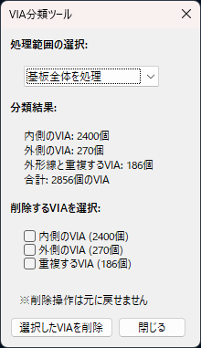

# Via分類ツール for KiCad

**Via分類ツール**は、KiCadで作成した基板上のVIA（スルーホール）を、基板の外形線（Edge.Cutsレイヤ）を基準に「内側」「外側」「重複」に分類するプラグインです。

## 特長

- VIAの分類（内側 / 外側 / 外形線と重複）
- 選択されたVIAのみ、または基板全体を対象に処理
- 分類結果の確認と不要なVIAの削除
- wxPythonによるGUI操作

---

## インストール方法

1. このリポジトリをクローンまたはダウンロードします。
2. `via-classifier-plugin.py` と `via_classifier.png` を KiCad のスクリプトディレクトリ（例: `~/.kicad/scripting/plugins/`）に配置します。
3. KiCadのPCBエディタを再起動します。
4. ツールバーに  が表示されます。

---

## 使い方

1. PCBエディタで基板データ（.kicad_pcb）を開きます。
2. 分類対象のVIAを選択する（または選択せずに基板全体を対象にする）。
3. ツールバーの「Via分類ツール」アイコン  をクリック。
4. 分類結果のダイアログが表示されます。
5. 「削除するVIAを選択」から不要なVIAにチェックを入れて削除可能。

---

## 注意点

- 外形線は必ず `Edge.Cuts` レイヤーに正しく作図してください。
- 外形線の矩形形状に対応。
- VIAの削除操作は元に戻せません。実行前にバックアップを取ってください。

---

## 開発環境

- KiCad 9.0.2 以降（KiCad scripting API）
- Python 3.x
- wxPython

---

## ライセンス

このソフトウェアは [CC0 1.0 Universal (Public Domain Dedication)](https://creativecommons.org/publicdomain/zero/1.0/deed.ja) ライセンスの下で公開されています。

あなたは本ソフトウェアを**自由に使用・複製・改変・再配布**できます。著作権表示も不要です。

